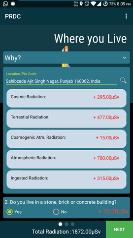
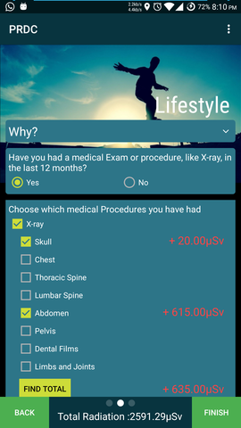
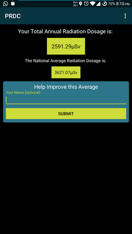
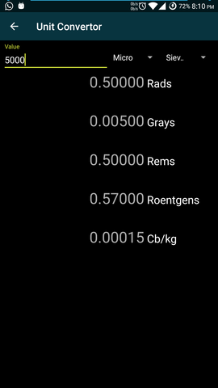

# Personal Radiation Dosage Calculator

>The earth has been surrounded with radiation ever since its inception. There is background radiation in the air, there is a constant cosmic radiation from the cosmic rays, there is a small amount of radiation even in the food we consume. Not all of this radiation is harmful. At a moderate level, radiation has a lot of uses.
>But there is a misconception among the general populous that all of nuclear radiation is harmful and this has led to people protesting nuclear power plants.
>This app aims to clear that misconception and tells the user his own personal Radiation Dosage in an year and then compares it with the national average. This national average is crowd-sourced from the users of the application and is taken directly from a real-time database.

## Screenshots

|Screen | Preview|
|:-----:|:-------:|
|Location Fragment||
|Lifestyle Fragment||
|Final Fragment||
|Convertor Activity||

# NOTE

###### The Application uses Google Play Services API for location & altitude detection

###### The API key is placed in build.gradle for the app. Key placed in this repository is a demo key and does not work. Please generate an API key from Google Developer Console and replace the current key in app/build.gradle

